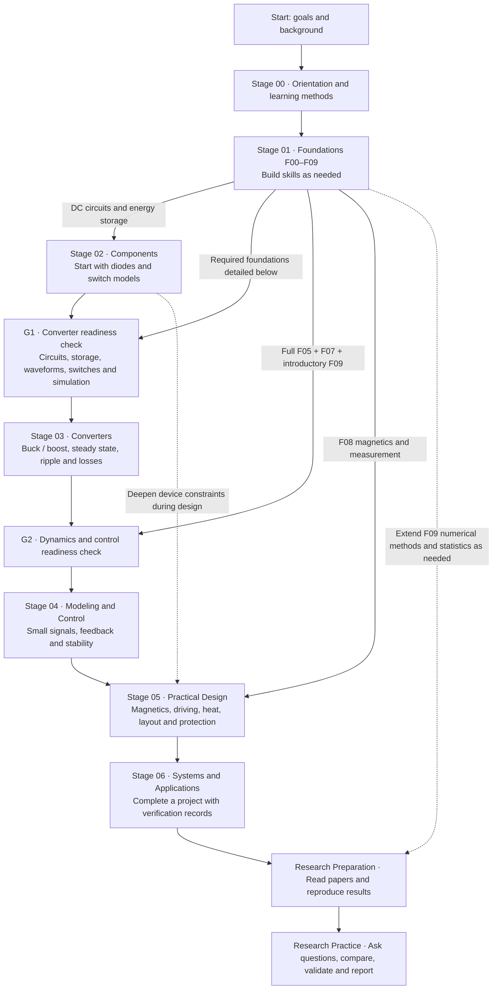
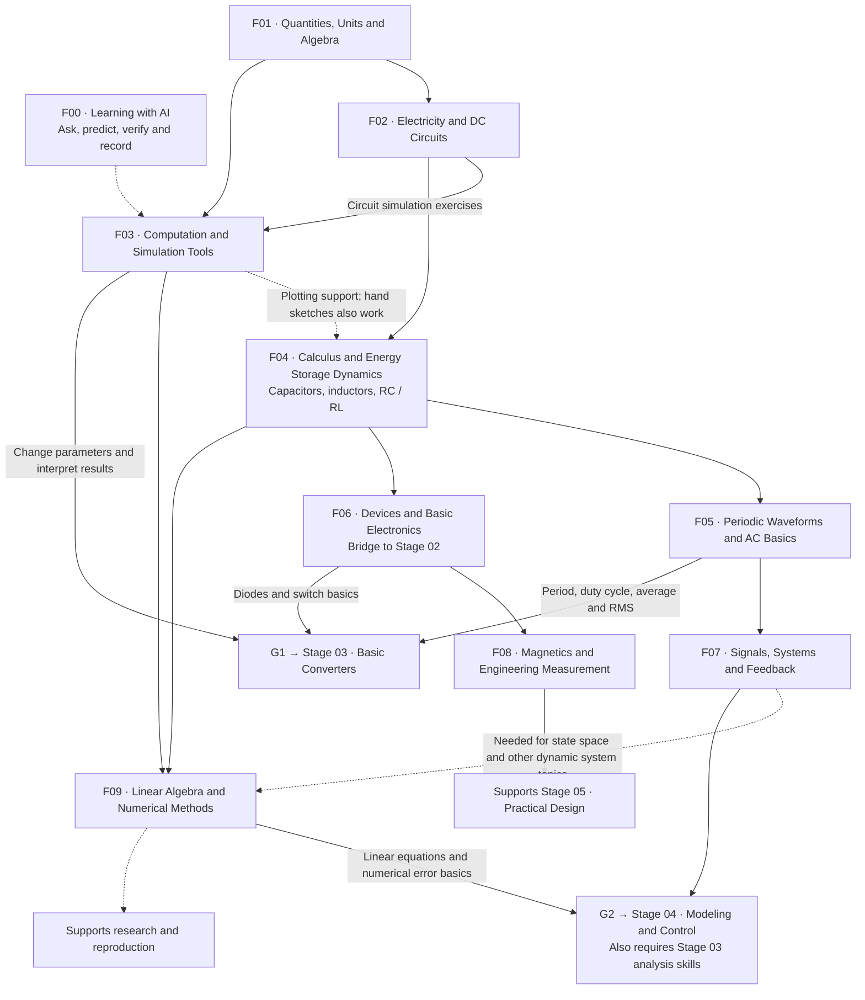

# AIPE Academy

**English** | [简体中文](README.zh-CN.md)

AIPE Academy is an open-source learning framework for power electronics education in the AI era.

## Start learning with Codex

Share this repository link or open this folder in Codex, then say: **“Guide me through AIPE Academy from the beginning.”** You do not need to know how to write prompts or choose a textbook first.

Start with [Start here](START-HERE.md). The tutor uses a short conversation to find your starting point, guides small exercises and projects, and records evidence of progress. For AI assistants responding to a learning request: read [the tutor workflow](prompts/tutor-guide.md) before beginning.

The [prerequisite path (in Chinese)](curriculum/01-foundations/prerequisite-path.zh-CN.md) bridges school-level basics to undergraduate circuits and power electronics. The [MIT / Princeton foundation review (in Chinese)](references/undergraduate-foundations-review.zh-CN.md) explains the course and textbook references. The first introductory lesson is available; most later topics remain outlines for development.

The goal is simple: a learner with only a computer, curiosity, and an AI coding assistant should be able to move from zero background to practical power electronics capability through a structured, project-based path.

This repository is the public front door for that vision. It will host the learning map, teaching materials, project briefs, simulation tasks, lab-style exercises, and AI interaction prompts that help students learn power electronics step by step.

## Education to Research

AIPE Academy is intended to support two phases, with power electronics as its first domain:

1. **Education — current priority.** Build the prerequisites, physical intuition, analysis skills, and project experience needed to understand and design power converters with an AI mentor. The seven curriculum stages below belong to this phase.
2. **Research — planned progression.** Move from understanding established results to reading papers, reproducing results, defining research questions, and validating original work. This phase is a direction for development, not an implemented research curriculum.

The technical foundation is Erickson and Maksimović's *Fundamentals of Power Electronics* and the CU Boulder power electronics teaching ecosystem. See the [initial research and framework discussion (in Chinese)](references/erickson-foundation-review.zh-CN.md) and [source register](references/erickson-sources.json), checked on September 6, 2026. The framework mapping is AIPE Academy's proposal, not a CU Boulder program or endorsement.

## Why This Exists

Traditional engineering education is powerful, but it is often expensive, slow, and hard to personalize. AI changes the learning interface.

AIPE Academy treats AI as a one-on-one mentor that can:

- explain concepts at the learner's level
- turn theory into simulations and small experiments
- review calculations, code, and design choices
- guide students through a curriculum without requiring a formal university setting

The long-term vision is to make power electronics education open, practical, and accessible to junior high students, high school students, self-taught engineers, and industry beginners.

## Syllabus and Prerequisites

This path answers three questions: **What should I learn now, why does it come first, and what does it prepare me for?** AIPE Academy designed this path with reference to university courses. See the [MIT / Princeton foundation review (in Chinese)](references/undergraduate-foundations-review.zh-CN.md) and [Erickson course review (in Chinese)](references/erickson-foundation-review.zh-CN.md) for the sources.

The first diagram shows the path from orientation to research. The second expands the foundation modules. **Solid arrows indicate required knowledge or demonstrated skills; dashed arrows indicate supporting study that can be interleaved.** Multiple solid arrows entering a node mean that all those foundations are needed. An arrow does not require reading an entire textbook. Prerequisites inherited through earlier modules are not drawn again.

### 1. The Overall Path: From Orientation to Research



**You do not need to finish every foundation module before starting a project.** Once you meet G1, begin buck / boost analysis. Add G2 foundations when approaching control, then deepen magnetics, measurement and numerical methods during design and research. The diagram shows the sequence for complete design tasks; simple component selection and measurement exercises can start earlier.

### 2. Foundation Dependencies

F00–F09 are submodules of Stage 01. F00 can also run alongside Stage 00. F05, F06 and F09 contain several levels of depth; only the relevant parts are needed before the first project.



F02 establishes circuit reasoning. F04 extends static circuits to behavior over time. F05 describes switching through waveforms, while F07 explains how systems respond to inputs and feedback. F03 supplies computational tools throughout the path. F08 connects physical models to engineering, and F09 helps evaluate complex models and research results.

### 3. Foundation Module Syllabus

| Module | What you learn | Why the prerequisites matter | Evidence of learning |
|---|---|---|---|
| **F00 Learning with AI** | Ordinary-language questions, predictions, verification and records | No prerequisites or prompt-writing experience needed | Describe a gap and explain a learning result in your own words |
| **F01 Quantities, Units and Algebra** | Ratios, unit conversions, equations and graphs | No prerequisites; revisit arithmetic when needed | Distinguish W from Wh and check orders of magnitude |
| **F02 Electricity and DC Circuits** | Voltage, current, power, series/parallel circuits, KCL/KVL and equivalents | F01 supports equations, calculations and unit checks | Explain why a voltage divider changes when loaded |
| **F03 Computation and Simulation Tools** | Variables, functions, plots, models and parameter sweeps | F01 supports computation; circuit tasks also need F02 | Change one parameter, interpret results and state model assumptions |
| **F04 Calculus and Energy Storage Dynamics** | Slopes, areas, exponentials, differential equations and RC/RL responses | F02 provides circuit relationships; graphs reveal change | Predict capacitor voltage, inductor current and time constants |
| **F05 Periodic Waveforms and AC Basics** | Period, duty cycle, average, RMS, phasors and impedance | F04 connects rates of change and storage to waveforms and AC analysis | Distinguish average from RMS and explain frequency effects |
| **F06 Devices and Basic Electronics** | Diodes, MOSFETs, op-amps, operating points, small signals and losses | F02/F04 give device models a circuit and dynamic context | Compare ideal and real switch behavior |
| **F07 Signals, Systems and Feedback** | Steps, frequency response, Laplace transforms, poles and Bode plots | F04/F05 connect time-domain behavior to frequency-domain descriptions | Explain filtering, negative feedback and model limits |
| **F08 Magnetics and Engineering Measurement** | Induction, magnetic circuits, saturation, ranges, sampling, error and heat | F04/F06 connect storage and devices to real constraints | Explain possible discrepancies between models and measurements |
| **F09 Linear Algebra and Numerical Methods** | Linear equations, matrices, state space, step size, error and basic statistics | F03/F04 support numerical work; dynamic system topics also need F07 | Compare simulation settings, record errors and assess reliability |

See the [prerequisite path (in Chinese)](curriculum/01-foundations/prerequisite-path.zh-CN.md) for exercises and the G1/G2/G3 criteria. F06 bridges into Stage 02; it does not require taking the same material twice. Measurement awareness from F08 begins with early circuit exercises.

### 4. Domain Courses and Research Progression

| Stage | What you learn | Prerequisites and their purpose | Assignment / project milestone |
|---|---|---|---|
| [Stage 00 · Orientation](curriculum/00-orientation/README.md) | Conversion types, applications, a field map and learning methods | No technical prerequisites; establish a purpose | Draw the energy flow of a familiar product |
| [Stage 01 · Foundations](curriculum/01-foundations/README.md) | F00–F09, introduced as tasks require them | Use a diagnostic to find the starting point | Units, voltage dividers, RC/RL and waveform exercises |
| [Stage 02 · Components](curriculum/02-components/README.md) | Passive parts, semiconductors, datasheets, parasitics and ratings | F02/F04 explain how components affect circuits | Compare component models and justify selection |
| [Stage 03 · Converters](curriculum/03-converters/README.md) | Buck, boost, isolated topologies, PWM, CCM/DCM, ripple and efficiency | Pass G1; understand storage and switches before analyzing switching states | Derive and simulate a converter, then explain parameter changes |
| [Stage 04 · Modeling and Control](curriculum/04-modeling-and-control/README.md) | Averaged and small-signal models, transfer functions, compensation, stability and digital control basics | Stage 03 + G2; understand the operating point before disturbances and regulation | Design a feedback regulator and check load-step response |
| [Stage 05 · Practical Design](curriculum/05-practical-design/README.md) | Magnetics, driving, isolation, protection, layout, EMI, heat and measurement | Relevant Stage 02–04 skills and F08 translate theory into constrained designs | Document specifications, components, losses, control and verification |
| [Stage 06 · Systems and Applications](curriculum/06-systems-and-applications/README.md) | Solar, storage, vehicles, motors and server power systems | Stage 05 provides converter design skills before system interfaces and tradeoffs | Complete a system project with specifications and verification records |
| **Research Preparation (planned)** | Choose a direction, search literature, read papers, reproduce results and analyze error | Project skills + topic-specific F09 content establish a reliable baseline | A reproduction report that someone else can rerun |
| **Research Practice (planned)** | Define questions, form hypotheses, compare fairly, validate and communicate | Use reproduction work to identify a researchable question | A report, experimental materials, limitations and follow-up questions |

**Using this syllabus:** Start at the earliest skill you have not demonstrated. Move forward when you can complete a task independently and explain what changes under new conditions. Add specialized mathematics, devices or control topics as a research question requires. Completing coursework and producing original research are distinct achievements.

**Current status:** The [learning entry point](START-HERE.md), tutor workflow and [first original lesson (in Chinese)](curriculum/01-foundations/first-lesson.zh-CN.md) are available. Most other modules are outlines and project specifications; research remains planned. Diagram connections describe the intended learning relationships, not completed course materials.

## AI-Native Study Loop

Each topic should eventually include:

- a plain-language explanation
- a concept map
- example calculations
- simulation tasks
- hands-on or lab-style exercises
- common mistakes
- AI tutor prompts
- self-check questions
- extension challenges

The intended workflow is:

1. Read the topic brief.
2. Ask an AI mentor to explain it at your level.
3. Run a simulation or calculation.
4. Compare the result with the expected behavior.
5. Ask the AI to challenge your understanding.
6. Record what you learned.
7. Move to the next project.

## Repository Structure

Current structure:

```text
.
+-- index.html
+-- styles.css
+-- START-HERE.md
+-- AGENTS.md
+-- assets/
|   +-- hero-power-electronics-ai.png
+-- curriculum/
|   +-- README.md
|   +-- 00-orientation/
|   +-- 01-foundations/
|   +-- 02-components/
|   +-- 03-converters/
|   +-- 04-modeling-and-control/
|   +-- 05-practical-design/
|   +-- 06-systems-and-applications/
+-- prompts/
|   +-- ai-tutor-prompts.md
|   +-- tutor-guide.md
+-- references/
|   +-- power-electronics-reading-map.md
+-- templates/
|   +-- topic-template.md
+-- README.md
+-- README.zh-CN.md
+-- LICENSE.md
```

Planned expansion:

```text
labs/
  spice/
  python/
  hardware/

projects/
  beginner/
  intermediate/
  advanced/

diagrams/
  concept-maps/
  converter-current-paths/
  system-block-diagrams/
```

## Website

Open `index.html` in a browser to view the current static showcase page.

No build step is required.

## Contributing Direction

Good contributions should help learners move from confusion to capability.

Useful contribution types include:

- beginner-friendly explanations
- diagrams and concept maps
- converter design walkthroughs
- simulation files
- Python analysis notebooks
- datasheet reading guides
- safety notes
- AI prompt templates
- project briefs with expected learning outcomes

## License

The repository currently includes a Creative Commons Attribution 4.0 International license in `LICENSE.md`, suitable for open educational content.
