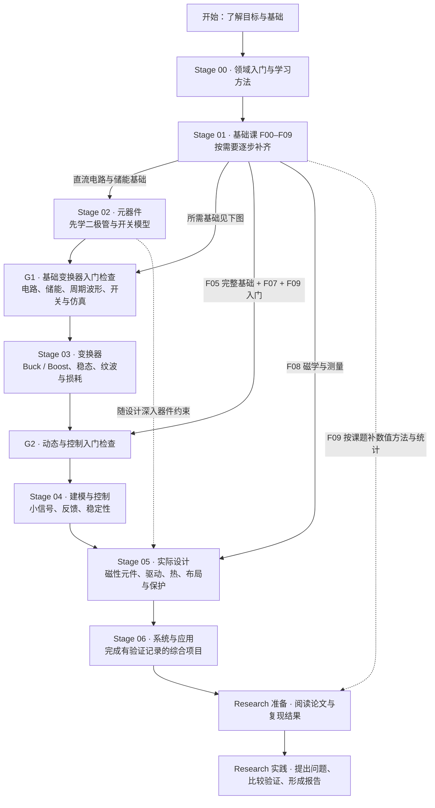
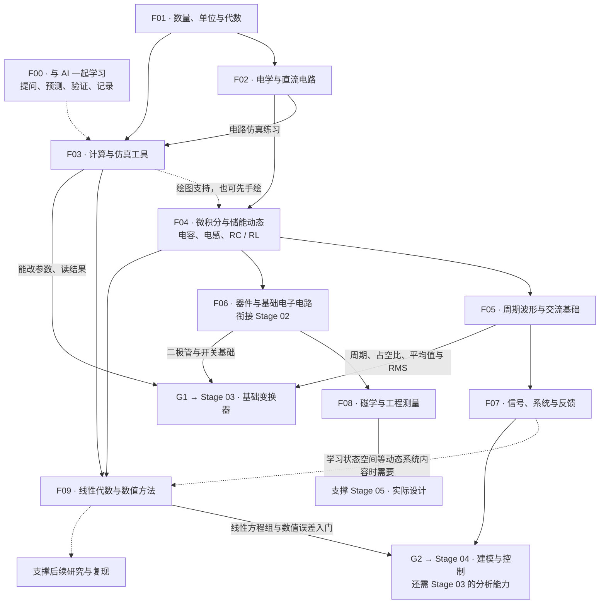

# AIPE Academy

AIPE Academy is an open-source learning framework for power electronics education in the AI era.

## Start learning with Codex

Share this repository link or open this folder in Codex, then say: **“请按 AIPE Academy 带我从零学习。”** You do not need to know how to write prompts or choose a textbook first.

Start with [从这里开始 / Start here](START-HERE.md). The tutor uses a short conversation to find your starting point, guides small exercises and projects, and records evidence of progress. For AI assistants responding to a learning request: read [the tutor workflow](prompts/tutor-guide.md) before beginning.

The [prerequisite path](curriculum/01-foundations/prerequisite-path.zh-CN.md) bridges school-level basics to undergraduate circuits and power electronics. The [MIT / Princeton foundation review](references/undergraduate-foundations-review.zh-CN.md) explains the course and textbook references. The first introductory lesson is available; most later topics remain outlines for development.

The goal is simple: a learner with only a computer, curiosity, and an AI coding assistant should be able to move from zero background to practical power electronics capability through a structured, project-based path.

This repository is the public front door for that vision. It will host the learning map, teaching materials, project briefs, simulation tasks, lab-style exercises, and AI interaction prompts that help students learn power electronics step by step.

## Education to Research

AIPE Academy is intended to support two phases, with power electronics as its first domain:

1. **Education — current priority.** Build the prerequisites, physical intuition, analysis skills, and project experience needed to understand and design power converters with an AI mentor. The seven curriculum stages below belong to this phase.
2. **Research — planned progression.** Move from understanding established results to reading papers, reproducing results, defining research questions, and validating original work. This phase is a direction for development, not an implemented research curriculum.

The technical foundation is Erickson and Maksimović's *Fundamentals of Power Electronics* and the CU Boulder power electronics teaching ecosystem. See the [initial research and framework discussion (中文)](references/erickson-foundation-review.zh-CN.md) and [source register](references/erickson-sources.json), checked on September 6, 2026. The framework mapping is AIPE Academy's proposal, not a CU Boulder program or endorsement.

## Why This Exists

Traditional engineering education is powerful, but it is often expensive, slow, and hard to personalize. AI changes the learning interface.

AIPE Academy treats AI as a one-on-one mentor that can:

- explain concepts at the learner's level
- turn theory into simulations and small experiments
- review calculations, code, and design choices
- guide students through a curriculum without requiring a formal university setting

The long-term vision is to make power electronics education open, practical, and accessible to junior high students, high school students, self-taught engineers, and industry beginners.

## 课程大纲与先修关系 / Syllabus

这条路线回答三个问题：**现在学什么、为什么先学它、学会后可以进入哪里。** 它是 AIPE Academy 参考大学课程后设计的学习路径；各校课程与教材依据见 [MIT / Princeton 基础课程调研](references/undergraduate-foundations-review.zh-CN.md)和 [Erickson 专业课程调研](references/erickson-foundation-review.zh-CN.md)。

下面分两张图：第一张展示从入门到研究的主线，第二张展开基础课之间的关系。**实线表示进入后续内容需要的基础或能力；虚线表示可穿插学习的支持内容。** 多条实线汇入同一节点时，需要具备这些基础。箭头表示掌握要求，不要求先读完整本教材；图中已通过中间课程继承的先修不重复连线。

### 1. 总体路线：从入门到研究



**不用先学完所有基础课才开始做项目。** 完成 G1 所需的基础后就可以开始 Buck / Boost；学习动态控制时再补 G2，工程设计和研究阶段继续补磁学、测量与数值方法。上图展示主线中完整设计任务的顺序，简单器件选型和测量练习可以更早穿插。

### 2. 基础课展开：哪个模块支撑哪个模块

F00–F09 都属于 Stage 01 的子模块，F00 也可在 Stage 00 同时进行。F05、F06、F09 内部有不同深度，进入第一项目前只需其中的相关部分。



F02 是理解电路的基础；F04 把静态电路推进到“随时间变化”；F05 用波形描述开关行为；F07 则解释系统如何响应输入和反馈。F03 是贯穿学习的计算工具，F08 连接物理模型与真实工程，F09 帮助检验复杂模型和研究结果。

### 3. 基础模块 syllabus

| 模块 | 学什么 | 为什么需要这些先修 | 完成时的能力证据 |
|---|---|---|---|
| **F00 与 AI 一起学习** | 普通语言提问、预测、验证和学习记录 | 无先修；不会写提示词也能开始 | 能说清哪里不懂，并复述一次学习结果 |
| **F01 数量、单位与代数** | 比例、单位换算、方程和读图 | 无先修；按诊断补四则运算 | 能区分 W / Wh，计算并检查数量级 |
| **F02 电学与直流电路** | 电压、电流、功率、串并联、KCL/KVL、等效电路 | F01 提供列式、计算和单位检查能力 | 能解释分压器接负载后为什么变化 |
| **F03 计算与仿真工具** | 变量、函数、绘图、模型与参数扫描 | F01 支撑计算；电路仿真任务还需 F02 | 能改变一个参数并读出结果，说明模型假设 |
| **F04 微积分与储能动态** | 斜率、面积、指数、微分方程、RC/RL 响应 | F02 提供电路关系；绘图帮助理解变化 | 能预测电容电压、电感电流与时间常数 |
| **F05 周期波形与交流基础** | 周期、占空比、平均值、RMS、相量与阻抗 | F04 的变化率与储能概念支撑波形和交流分析 | 能区分平均值与 RMS，解释不同频率的影响 |
| **F06 器件与基础电子电路** | 二极管、MOSFET、运放、工作点、小信号和损耗 | F02/F04 使器件模型有电路与动态基础 | 能比较理想开关和实际开关的行为 |
| **F07 信号、系统与反馈** | 阶跃、频率响应、拉普拉斯变换、极点、Bode 图 | F04/F05 连接时域变化与频域描述 | 能解释滤波与负反馈，识别模型适用范围 |
| **F08 磁学与工程测量** | 感应、磁路、饱和、量程、采样、误差与热 | F04/F06 连接储能、器件和真实限制 | 能说明模型与测量不一致的可能原因 |
| **F09 线性代数与数值方法** | 方程组、矩阵、状态空间、步长、误差与统计入门 | F03/F04 支撑数值计算；动态系统内容再接 F07 | 能比较仿真设置，记录误差并判断结论是否可靠 |

更详细的练习和 G1/G2/G3 掌握标准见[先修路线](curriculum/01-foundations/prerequisite-path.zh-CN.md)。F06 是 Stage 02 的入门桥接，不需要重复学两遍；F08 的测量意识从早期电路任务就开始培养。

### 4. 专业课程与研究递进

| 课程阶段 | 学什么 | 先修关系与原因 | 作业 / 项目里程碑 |
|---|---|---|---|
| [Stage 00 · Orientation](curriculum/00-orientation/README.md) | 电能转换类型、应用、领域地图与学习方法 | 无技术先修；先明确学习目的 | 画一个熟悉产品的能量流 |
| [Stage 01 · Foundations](curriculum/01-foundations/README.md) | 上述 F00–F09，按任务分批学习 | 从诊断确定起点 | 单位计算、分压器、RC/RL 和波形练习 |
| [Stage 02 · Components](curriculum/02-components/README.md) | 无源器件、半导体、数据手册、寄生与额定值 | 先有 F02/F04，再理解器件怎样影响电路 | 对比器件模型并说明选型依据 |
| [Stage 03 · Converters](curriculum/03-converters/README.md) | Buck、Boost、隔离拓扑、PWM、CCM/DCM、纹波与效率 | 通过 G1；先理解储能和开关，才能分析每个开关状态 | 推导并仿真一个变换器，解释参数变化 |
| [Stage 04 · Modeling and Control](curriculum/04-modeling-and-control/README.md) | 平均与小信号模型、传递函数、补偿、稳定性、数字控制入门 | Stage 03 + G2；先理解稳态工作点，再研究扰动和调节 | 设计闭环稳压，检验负载阶跃响应 |
| [Stage 05 · Practical Design](curriculum/05-practical-design/README.md) | 磁性元件、驱动、隔离、保护、布局、EMI、热与测量 | 基于 Stage 02–04 的相关能力和 F08，把理论方案落实到约束 | 完成规格、器件、损耗、控制与验证说明 |
| [Stage 06 · Systems and Applications](curriculum/06-systems-and-applications/README.md) | 光伏、储能、汽车、电机与服务器供电等系统 | Stage 05 提供单个变换器的设计能力，再处理系统接口与权衡 | 完成一个有规格和验证记录的综合项目 |
| **Research 准备（规划）** | 选方向、检索、读论文、复现与误差分析 | 综合项目能力 + 课题所需的 F09；能检验已有结果才有研究基线 | 一份别人可以复运行的复现报告 |
| **Research 实践（规划）** | 提出问题、形成假设、公平对比、验证与表达 | 基于复现结果找出可研究的问题 | 研究报告、实验材料、局限与后续问题 |

**如何使用这份 syllabus：** 从最早尚未掌握的节点开始；能独立完成任务并解释改变条件后的结果，再进入后续节点。研究主题需要的专门数学、器件或控制知识，可以沿分支继续补充。完成课程与产生原创研究成果是不同的能力要求。

**当前建设状态：** [学习入口](START-HERE.md)、导师流程和[第一节原创示范](curriculum/01-foundations/first-lesson.zh-CN.md)已提供；其余模块主要仍是大纲与项目规格，研究部分为规划。图中的连线表示拟定的学习关系，不表示所有课程材料已经完成。

## AI-Native Study Loop

Each topic should eventually include:

- a plain-language explanation
- a concept map
- example calculations
- simulation tasks
- hands-on or lab-style exercises
- common mistakes
- AI tutor prompts
- self-check questions
- extension challenges

The intended workflow is:

1. Read the topic brief.
2. Ask an AI mentor to explain it at your level.
3. Run a simulation or calculation.
4. Compare the result with the expected behavior.
5. Ask the AI to challenge your understanding.
6. Record what you learned.
7. Move to the next project.

## Repository Structure

Current structure:

```text
.
+-- index.html
+-- styles.css
+-- START-HERE.md
+-- AGENTS.md
+-- assets/
|   +-- hero-power-electronics-ai.png
+-- curriculum/
|   +-- README.md
|   +-- 00-orientation/
|   +-- 01-foundations/
|   +-- 02-components/
|   +-- 03-converters/
|   +-- 04-modeling-and-control/
|   +-- 05-practical-design/
|   +-- 06-systems-and-applications/
+-- prompts/
|   +-- ai-tutor-prompts.md
|   +-- tutor-guide.md
+-- references/
|   +-- power-electronics-reading-map.md
+-- templates/
|   +-- topic-template.md
+-- README.md
+-- LICENSE.md
```

Planned expansion:

```text
labs/
  spice/
  python/
  hardware/

projects/
  beginner/
  intermediate/
  advanced/

diagrams/
  concept-maps/
  converter-current-paths/
  system-block-diagrams/
```

## Website

Open `index.html` in a browser to view the current static showcase page.

No build step is required.

## Contributing Direction

Good contributions should help learners move from confusion to capability.

Useful contribution types include:

- beginner-friendly explanations
- diagrams and concept maps
- converter design walkthroughs
- simulation files
- Python analysis notebooks
- datasheet reading guides
- safety notes
- AI prompt templates
- project briefs with expected learning outcomes

## License

The repository currently includes a Creative Commons Attribution 4.0 International license in `LICENSE.md`, suitable for open educational content.
